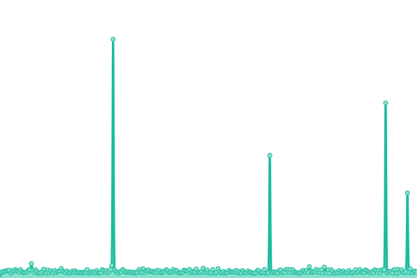
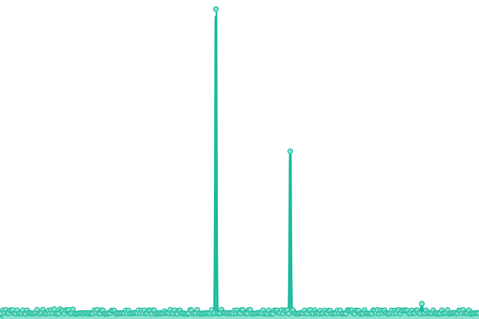

# [📈 Live Status](https://factiverse.github.io/api-upptime): <!--live status--> **🟩 All systems operational**

This repository contains the open-source uptime monitor and status page for [Factiverse](https://factiverse.github.io/api-upptime), powered by [Upptime](https://github.com/upptime/upptime).

With [Upptime](https://upptime.js.org), you can get your own unlimited and free uptime monitor and status page, powered entirely by a GitHub repository. We use [Issues](https://github.com/factiverse/api-upptime/issues) as incident reports, [Actions](https://github.com/factiverse/api-upptime/actions) as uptime monitors, and [Pages](https://factiverse.github.io/api-upptime) for the status page.

<!--start: status pages-->
<!-- This summary is generated by Upptime (https://github.com/upptime/upptime) -->
<!-- Do not edit this manually, your changes will be overwritten -->
<!-- prettier-ignore -->
| URL | Status | History | Response Time | Uptime |
| --- | ------ | ------- | ------------- | ------ |
|  [/statistics/claim_search](https://prod.factiverse.ai/v1/statistics/claim_search) | 🟩 Up | [statistics-claim-search.yml](https://github.com/factiverse/upptime-prod/commits/HEAD/history/statistics-claim-search.yml) | 

 424ms
     
 | 

<a href="https://factiverse.github.io/upptime-prod/history/statistics-claim-search">100.00%</a>
    

|  [/stance_detection](https://prod.factiverse.ai/v1/stance_detection) | 🟩 Up | [stance-detection.yml](https://github.com/factiverse/upptime-prod/commits/HEAD/history/stance-detection.yml) | 

 217ms
     
 | 

<a href="https://factiverse.github.io/upptime-prod/history/stance-detection">100.00%</a>
    

|  [/claim_detection](https://prod.factiverse.ai/v1/claim_detection) | 🟩 Up | [claim-detection.yml](https://github.com/factiverse/upptime-prod/commits/HEAD/history/claim-detection.yml) | 

 129ms
     
 | 

<a href="https://factiverse.github.io/upptime-prod/history/claim-detection">100.00%</a>
    

|  [/microfacts](https://prod.factiverse.ai/v1/microfacts) | 🟩 Up | [microfacts.yml](https://github.com/factiverse/upptime-prod/commits/HEAD/history/microfacts.yml) | 

 144ms
     
 | 

<a href="https://factiverse.github.io/upptime-prod/history/microfacts">100.00%</a>
    

|  [/claim_search](https://prod.factiverse.ai/v1/claim_search) | 🟩 Up | [claim-search.yml](https://github.com/factiverse/upptime-prod/commits/HEAD/history/claim-search.yml) | 

 129ms
     
 | 

<a href="https://factiverse.github.io/upptime-prod/history/claim-search">100.00%</a>
    

<!--end: status pages-->

[**Visit our status website →**](https://factiverse.github.io/api-upptime)

## 📄 License

- Powered by: [Upptime](https://github.com/upptime/upptime)
- Code: [MIT](./LICENSE) © [Factiverse](https://factiverse.github.io/api-upptime)
- Data in the `./history` directory: [Open Database License](https://opendatacommons.org/licenses/odbl/1-0/)
